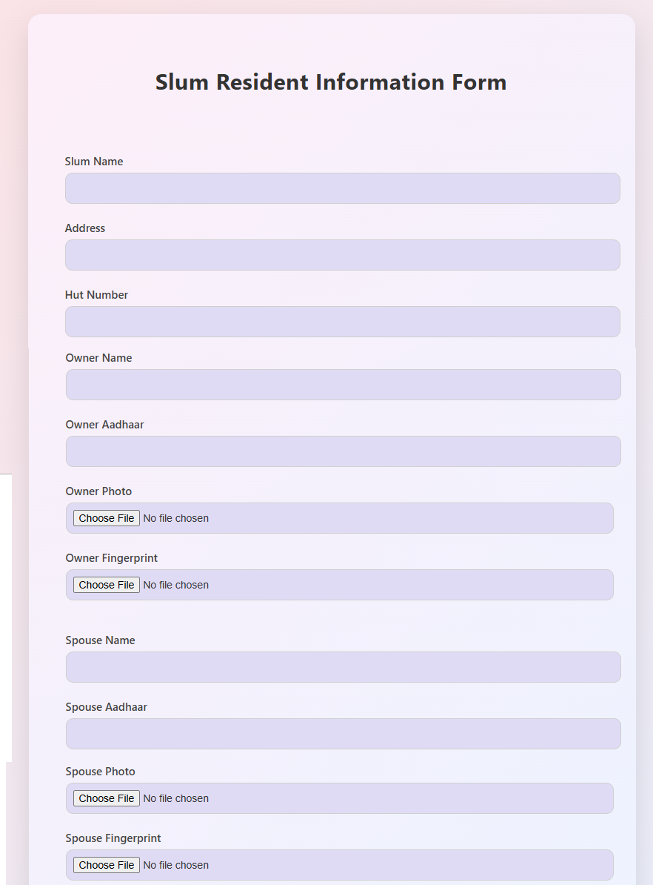
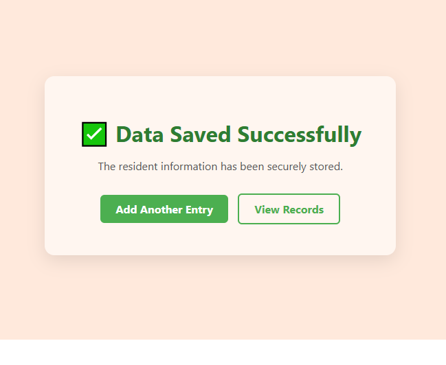
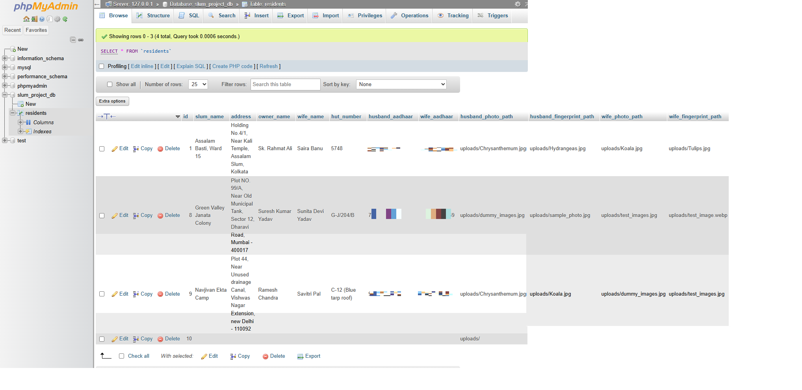

# Slum Resident Management System 

Slum Resident Management is a web application built using PHP and MySQL, for academic purposes.
It allows structured collection, storage, and viewing of basic resident information via a web form and admin panel.
The project will demonstrate a basic form handling, file uploading, database interaction, and display using basic web technologies.

---

## Features:

 1. Web Form for Gathering Resident Details
 2. Stores the following information:
  -  Slum Name and Address
  - Hut number
  - Owner and Spouse Names
  - Aadhaar numbers (masked during display)
  - Photo and Fingerprint Uploads
    
 3. Admin Panel - View Saved Records
 4. Aadhaar masking to reduce the exposure of sensitive information
 5. Simple readable interface
---
## Screenshots

### 1. Resident Information Form

### 2. Successful Data Submission

### 3. Admin – Residents List

### 4. Database View (phpMyAdmin)

---

## Privacy and Data Handling Notes:

The Aadhaar numbers are masked in the admin panel and all screenshots.
Uploaded photos and prints are just samples or dummy images.
No authentication and/or authorization is applied in this version.
The records will be view-only within the application, modifications and deletions will be done directly in the database.
This project is for academic and learning purposes only and cannot be used in real-world applications.

---

## Limitations

No need for login or role-based access control
Admin panel is publicly accessible if the URL is known.
No encryption provided for upload files No validation of duplicate or incorrect data Requires a local server environment

---

##  Technologies Used

- PHP
- MySQL
- HTML
- CSS
- XAMPP (Apache & phpMyAdmin)

---

##  Installation & Setup

Follow these steps to run the project locally
1. Install XAMPP or WAMP
2. Start Apache and MySQL
3. Copy the project folder into:   htdocs/ (XAMPP)
4. Open phpMyAdmin
5. Create a database named:   slum_project_db
6. Import the file:  database.sql
7. Update database credentials in:  db_connect.php
8. Open browser and visit:  http://localhost/slum_project/index.php

---

##  Live Deployment

This project is not deployed live because:
- GitHub Pages does not support PHP
- The application requires a local server and database

---

This project is created for educational purposes only.

